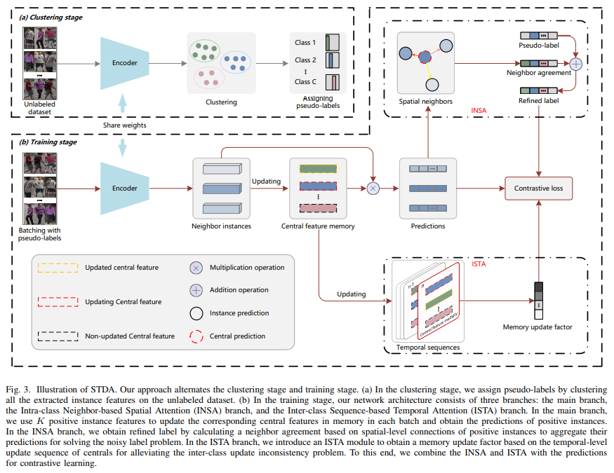

# Spatial and Temporal Dual-Attention (STDA)
Official PyTorch implementation of Spatial and Temporal Dual-Attention for Unsupervised Person Re-identification.

**We will release the code after our paper is accepted.**

## Overview

